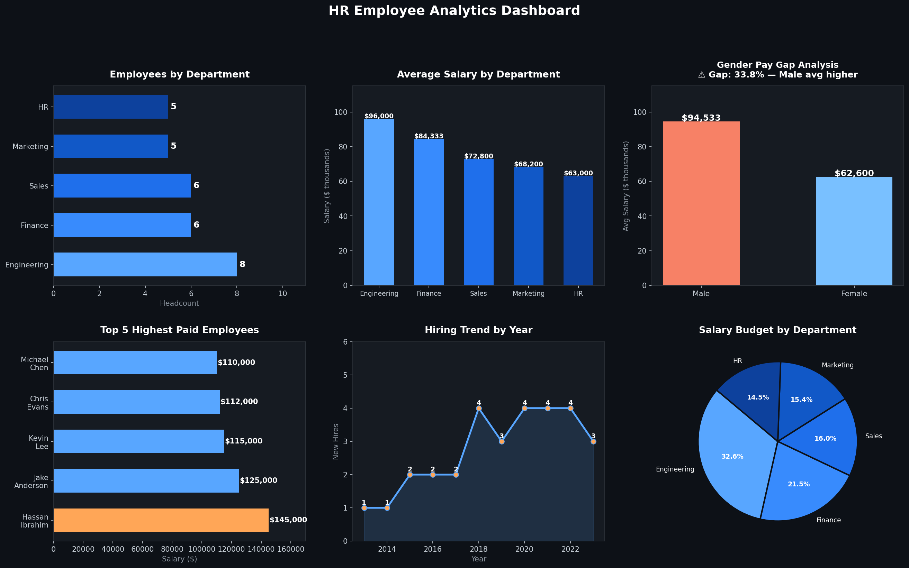

# HR Employee Data Analysis — SQL 👥

## Objective
Analyze a company's HR dataset using SQL to uncover workforce insights across
departments, salaries, gender equity, hiring trends, and budget allocation.

## Dataset
**30 employees** across 5 departments with the following fields:

| Column | Description |
|--------|-------------|
| employee_id | Unique identifier |
| full_name | Employee name |
| department | Engineering, Finance, Sales, HR, Marketing |
| job_title | Role/position |
| salary | Annual salary (USD) |
| hire_date | Date joined |
| age | Employee age |
| gender | Male / Female |
| country | Country of origin |

## SQL Queries & Key Findings

### 1. Headcount by Department
Engineering is the largest department with 8 employees; HR and Marketing each have 5.

### 2. Average Salary by Department
Engineering leads with an average salary of $96,000, while Sales has the lowest at $63,000.

### 3. Gender Distribution
The company is exactly 50/50 male-female — however...

### 4. ⚠️ Gender Pay Gap
Despite equal headcount, **male employees earn 33.8% more on average** ($94,533 vs $62,600).
This is a critical HR equity finding that warrants further investigation into role distribution.

### 5. Top 5 Highest Paid
The CFO (Finance) tops the list at $145,000, followed by the Tech Lead and three Senior Developers in Engineering.

### 6. Hiring Trend
Hiring accelerated significantly from 2018 onward, with 4 new hires in 2018, 2020, 2021, and 2022 — suggesting company growth phases.

### 7. Department Salary Budget
Engineering accounts for the largest salary spend at $768,000 — 33% of total payroll.

### 8. Country Diversity
Employees represent **16 countries**, with the USA being the most represented (8 employees).

## Dashboard

## Files
| File | Description |
|------|-------------|
| `hr_dataset.csv` | Raw employee dataset (30 records) |
| `hr_analysis.sql` | All 10 SQL queries with comments |
| `hr_dashboard.png` | Visual summary of key findings |

## Tools & Technologies
- **Query language:** SQL (SQLite-compatible)
- **Visualization:** Python (matplotlib)
- **Analysis type:** HR analytics, workforce reporting, equity analysis

## Skills Demonstrated
`SQL` · `GROUP BY` · `CASE WHEN` · `Subqueries` · `Aggregation` · `Data Storytelling`
